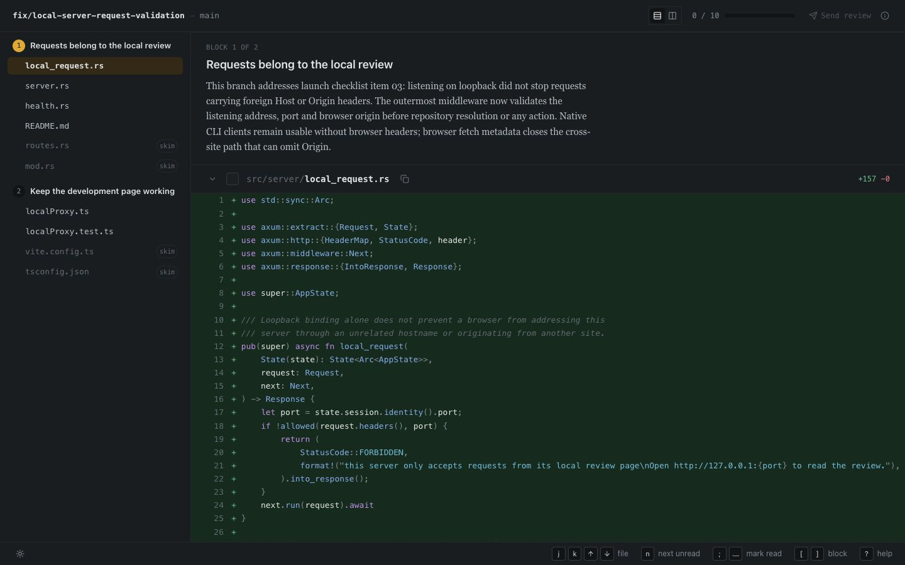
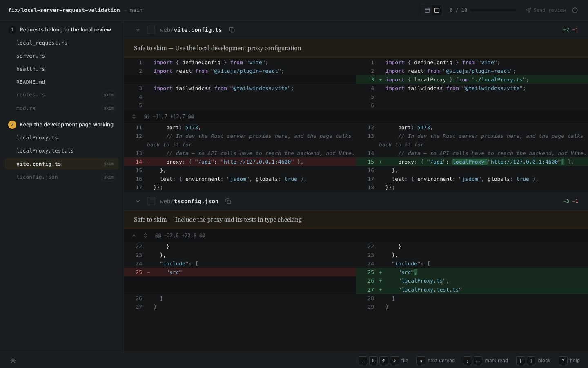
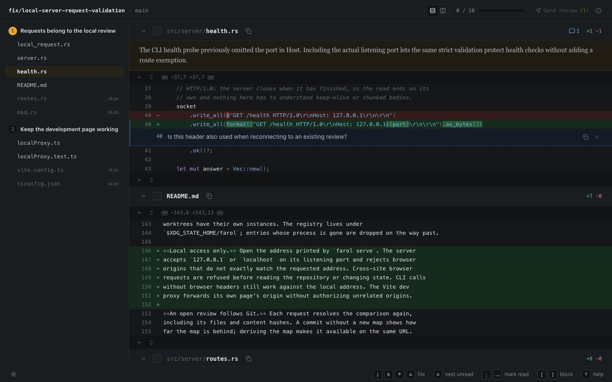
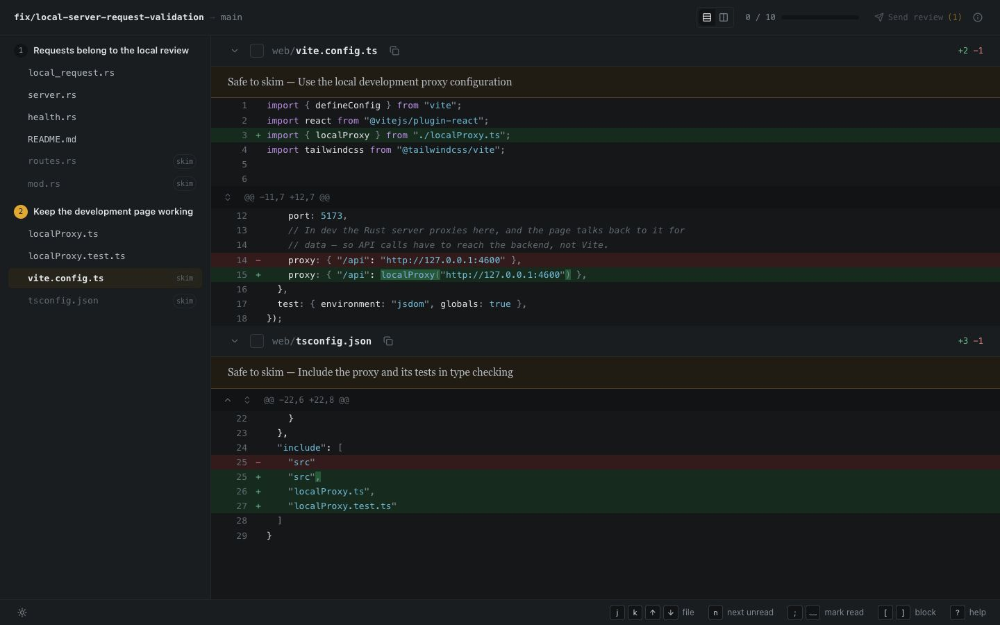

<p align="center">
  
</p>

<p align="center">
  A walkthrough, not a diff: the author's order, and the reasons behind it.
</p>

Farol is a local code-review app. It turns a branch diff into a guided walkthrough:
**files ordered to help you understand the feature, not alphabetically by path.**
The map puts the core implementation first and builds on it, with explanations
from the coding session that made the change. Read the code, leave comments,
and send the finished review to GitHub.



## Install

Download **one archive** and `SHA256SUMS` from the same
[release](https://github.com/asnunes/farol/releases) into an empty folder.

| Your machine | Choose the archive ending in |
|---|---|
| Mac with Apple Silicon, macOS 15+ | `aarch64-apple-darwin.tar.gz` |
| Mac with Intel, macOS 15+ | `x86_64-apple-darwin.tar.gz` |
| Linux x86_64, Ubuntu 22.04+ or glibc 2.35+ | `x86_64-unknown-linux-gnu.tar.gz` |

In that folder, verify the download:

- **macOS:** `shasum -a 256 --check SHA256SUMS --ignore-missing`
- **Linux:** `sha256sum --check SHA256SUMS --ignore-missing`

Once it reports `OK`, install:

```bash
tar -xzf farol-*.tar.gz
mkdir -p "$HOME/.local/bin"
install -m 755 ./farol "$HOME/.local/bin/farol"
export PATH="$HOME/.local/bin:$PATH"
farol --version
```

You need Git and a browser. macOS may require [approval to run the unsigned
binary](docs/install.md#macos-approval). For updates, removal, or PATH setup,
see the [installation guide](docs/install.md).

No release available yet? [Build from source](docs/development.md).

## Install the agent skills

In the project you want to review, install the complete skill set:

```bash
npx skills add https://github.com/asnunes/farol/tree/main/skills --skill '*'
```

The installer handles agent selection; add `--agent codex` or another supported
agent to choose explicitly. See [skills and workflows](docs/skills.md).

## Open your first review

In the repository and branch you want to review, check the changed files:

```bash
farol scope
```

Ask the coding agent that implemented the change to use `farol-maintain-map`
to prepare the review map. It loads the general Farol guidance and records the
implementation decisions from that session.

Then open the review:

```bash
farol serve
```

On macOS the browser opens automatically. On Linux, open the printed URL.
Farol needs a map before it can serve a review. You can also
[write one by hand](docs/usage.md#write-a-map).

## Review

### Read in the order the feature makes sense

The map orders blocks and files by their importance to understanding the change.
Start with the core implementation, then follow the parts that depend on it;
when one file needs context from another, that context comes first. Files from
different folders can sit together in the same block, with the implementation
decisions beside the code they explain. The sidebar and diff follow this reading
order instead of an alphabetical file tree.

Mark files as read as you go; your progress stays local and survives new commits
until a file changes.

### Compare side by side

Switch between unified and split views to read changes in the layout you prefer.
Split view puts the old and new code next to each other.



### Leave comments on the code

Click `+` or drag across line numbers to comment on a line or range. Comments
stay local until you use **Send review** to publish them to GitHub; the page
guides you through authorizing the destination host.



### Know what you can skim

The map marks supporting files as **skim** when they can be skipped without
missing the core implementation. Each carries a reason, so you can decide
whether to open it anyway.



Press `?` for keyboard shortcuts. Use `farol servers` to list open reviews.

## License

Farol is available under the [MIT License](LICENSE).

[CLI and behavior guide](docs/usage.md) · [Development](docs/development.md) ·
[Preparing a release](docs/releases.md)
